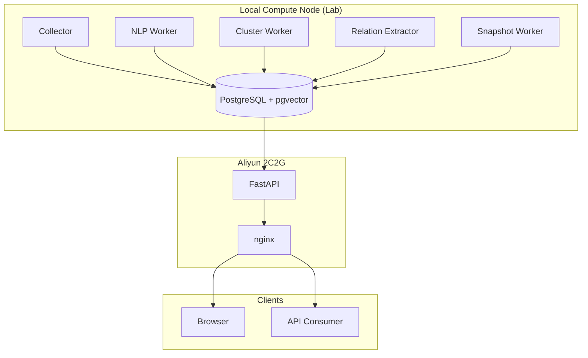

<div align="center">


# AgendaScope 观澜 · 全球议程设置监控平台

**面向国家安全与国际关系研究机构的全球主流媒体舆情实时监控与议程设置识别系统**

**国际关系学院 · 国家安全计算模拟实验室**

[](https://creativecommons.org/licenses/by-nc/4.0/)
[](backend/)
[](backend/app/main.py)
[](frontend/)
[](deploy/)
[](deploy/)
[](#llm-服务)

</div>

**English** | [中文](#中文)

A real-time monitoring and agenda-setting detection platform covering mainstream media across **172 countries** and **408 media outlets**. Designed for national security and international relations research, AgendaScope identifies who sets the agenda, who follows, and how narratives propagate across borders — with full traceability from raw articles to entity relationship graphs.

---

## 中文

### 🌟 核心能力

| 能力 | 说明 |
| --- | --- |
| 🗺️ **全球议程地图** | 172 国×今日报道量热力分布，点击国家下钻 Top 议题 |
| 🔥 **热点议题排行** | 全球/按国显著性 TOP 10，跨语言向量聚类 |
| 📡 **实时采集** | 408 个媒体源 RSS 高频轮询，发布到可见 ≤15 分钟 |
| 🔗 **议程溯源** | 回声消除折叠多国跟风报道，识别首发源与跨国传播链路 |
| 🕸️ **监控对象** | 50 精品关键人物/机构社交图谱，**每条关系边都有新闻证据支撑**（点边查看原文） |
| 🚨 **智能预警** | 规则评估 + 订阅推送 + LLM 中文摘要 |
| 🗄️ **结构化数据库** | L0-L3 四层架构 + article_processing 状态机 + 分布式任务队列（借鉴 GDELT 但超越） |
| 🔑 **数据开放平台** | RESTful API + X-API-Key 鉴权 + Redis 限流（`/developer`） |
| 📦 **私有化部署** | Docker Compose 单机交付，LLM 走经批准的云通道 |

### 🏗️ v4.0 分布式架构（NEW）

```
┌─────────────────────────────────────────────────────────────────┐
│  本地算力机（8核 32GB，导师实验室）                              │
│  采集 · NLP · 聚类 · 关系抽取 · 快照聚合                          │
└─────────────────────────────────────────────────────────────────┘
                          ↓ PostgreSQL（SSL 加密）
┌─────────────────────────────────────────────────────────────────┐
│  阿里云 2C2G/3Mbps                                              │
│  PostgreSQL · FastAPI · nginx（只读 API + 前端展示）             │
└─────────────────────────────────────────────────────────────────┘
                          ↓ HTTPS
┌─────────────────────────────────────────────────────────────────┐
│  用户浏览器 / 数据 API 客户端                                    │
└─────────────────────────────────────────────────────────────────┘
```

**关键设计**：
- **数据库即事实源**：所有看板/议题/事件/监控对象/预警功能都是对数据库的 `SELECT` 查询
- **处理状态机**：每篇文章的 NLP/聚类/实体抽取/关系抽取状态显式落库（`article_processing`），失败可重跑
- **分布式任务队列**：`worker_tasks` 表 + `FOR UPDATE SKIP LOCKED`，本地机器随时接入
- **议题生命周期事件**：每次合并/重命名/首发修正都留 `topic_lifecycle_events` 表
- **实体-文章显式关联**：`article_entities` 表替代 JSONB，可索引可连接

### 🗄️ 数据库四层架构（L0-L3）

| 层 | 表 | 职责 |
|----|----|------|
| **L0 原始层** | `articles` / `sources` / `collection_jobs` | 采集入库，原文+元数据 |
| **L1 加工层** | `article_processing` / `article_entities` / `worker_tasks` | 处理状态机 + 任务队列 |
| **L2 事实层** | `topics` / `agenda_events` / `persons_orgs` / `entity_relations` | 对外呈现的事实 |
| **L3 快照层** | `topic_snapshots` / `entity_snapshots` / `source_snapshots` | 预聚合时序数据，看板秒查 |

### 🚀 快速开始

#### 仅使用云端服务（无需部署）

```bash
# 浏览：https://www.wordread.cn
# 数据 API：https://www.wordread.cn/developer

curl -H "X-API-Key: YOUR_KEY" \
  "https://www.wordread.cn/api/v1/open/topics?status=heating&page_size=10"
```

#### 本地算力机接入（贡献采集/NLP 算力）

```bash
git clone https://github.com/yangyh-2025/agendascope.git
cd agendascope/local_workers
cp .env.example .env  # 填入云端 PG 连接串 + LLM API Key
docker compose --env-file .env up -d
```

详见 [local_workers/README.md](local_workers/README.md)。

#### 完整私有化部署（云端）

```bash
cd deploy
cp .env.example .env  # 配置 LLM_API_KEY 等
docker compose --env-file .env -f docker-compose.yml -f compose.deploy.yml up -d
```

### 📚 文档

- [详细设计](docs/dev/2-详细设计.md)：数据库 schema、状态机、算法
- [分布式部署指南](docs/dev/分布式部署指南.md)：本地算力机接入步骤
- [算力机申请单](docs/apply/本地算力机申请单.md)：给导师的硬件配置申请
- [API 文档](https://www.wordread.cn/developer/docs)：数据开放平台在线文档
- [CHANGELOG](CHANGELOG.md)：版本演进历史

### 🛠️ 技术栈

- **后端**：Python 3.11 + FastAPI + SQLAlchemy 2 + Alembic + pgvector
- **前端**：React 18 + TypeScript + Vite + ECharts + Three.js
- **数据库**：PostgreSQL 16 + pgvector（1024 维 embedding）
- **缓存**：Redis 7（30s GET 缓存 + API Key 限流）
- **LLM**：GLM-4-Flash / SiliconFlow（多模型池 + 失败转移熔断）
- **Embedding**：bge-m3（1024 维跨语言）
- **采集**：RSS + 网页抓取 + GDELT 兜底
- **部署**：Docker Compose + nginx + HTTPS（阿里云 SSL）

### 📊 数据规模

- **172** 个国家（含全球南方代表性国家）
- **408** 个媒体源（报纸/通讯社/广播/网络）
- **~500** 篇/天 文章采集
- **50** 个精品监控对象（避开元首与中国相关实体）
- **16** 种封闭关系类型（meets/sanctions/appoints/...）

### 🤝 贡献

本项目为学术研究项目，欢迎 Issue 与 Discussion。如需贡献代码，请先阅读 [详细设计](docs/dev/2-详细设计.md)。

### 📄 License

[CC BY-NC 4.0](https://creativecommons.org/licenses/by-nc/4.0/) — 仅限非商业学术用途

### 📧 联系

- **单位**：国际关系学院 · 国家安全计算模拟实验室
- **邮箱**：yangyuhang2667@163.com
- **GitHub Issues**：[yangyh-2025/agendascope/issues](https://github.com/yangyh-2025/agendascope/issues)

---

## English

### 🌟 Key Features

- **Global Agenda Map**: 172-country heatmap with drill-down to top topics
- **Topic Clustering**: Cross-lingual vector clustering (bge-m3) + LLM naming
- **Real-time Collection**: 408 media sources, ≤15min publication-to-visibility
- **Agenda Tracing**: First-source detection + cross-border propagation chain
- **Entity Watchlist**: 50 curated entities with evidence-backed relation graph
- **Structured Database**: L0-L3 layered schema + processing state machine + distributed task queue
- **Open Data API**: RESTful endpoints with X-API-Key authentication
- **Self-hosted**: Docker Compose single-machine deployment

### 🏗️ Architecture (v4.0)



### 🗄️ Database Layers

| Layer | Tables | Purpose |
|-------|--------|---------|
| **L0 Raw** | `articles`, `sources`, `collection_jobs` | Raw crawled content |
| **L1 Processing** | `article_processing`, `article_entities`, `worker_tasks` | State machine + task queue |
| **L2 Facts** | `topics`, `agenda_events`, `persons_orgs`, `entity_relations` | Presentation-ready facts |
| **L3 Snapshots** | `topic_snapshots`, `entity_snapshots`, `source_snapshots` | Pre-aggregated time series |

### 🚀 Quick Start

**Use hosted service** (no deployment):
```bash
curl -H "X-API-Key: YOUR_KEY" \
  "https://www.wordread.cn/api/v1/open/topics?status=heating"
```

**Run local compute node**:
```bash
git clone https://github.com/yangyh-2025/agendascope.git
cd agendascope/local_workers
cp .env.example .env  # Fill in DATABASE_URL and LLM_API_KEY
docker compose --env-file .env up -d
```

**Self-host full stack**:
```bash
cd deploy
cp .env.example .env
docker compose --env-file .env -f docker-compose.yml -f compose.deploy.yml up -d
```

### 📊 Scale

- **172** countries · **408** media sources · **~500** articles/day
- **50** curated entities (heads of state & China-related excluded by design)
- **16** closed relation types (meets/sanctions/appoints/...)

### 📄 License

[CC BY-NC 4.0](https://creativecommons.org/licenses/by-nc/4.0/) — Academic non-commercial use only

### 📧 Contact

- **Lab**: School of International Relations · National Security Computational Simulation Lab
- **Email**: yangyuhang2667@163.com
- **Issues**: [yangyh-2025/agendascope/issues](https://github.com/yangyh-2025/agendascope/issues)
